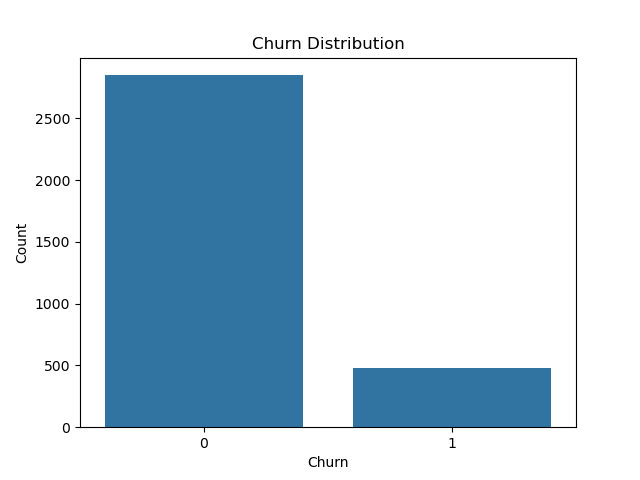
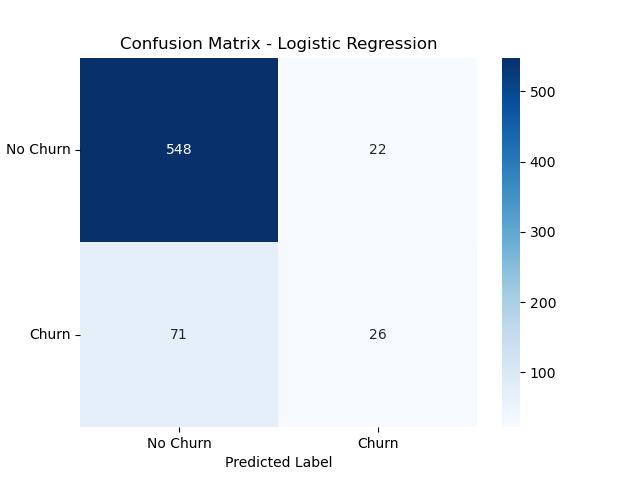
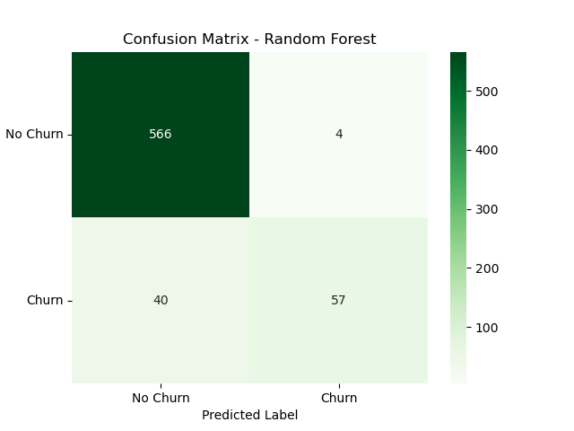
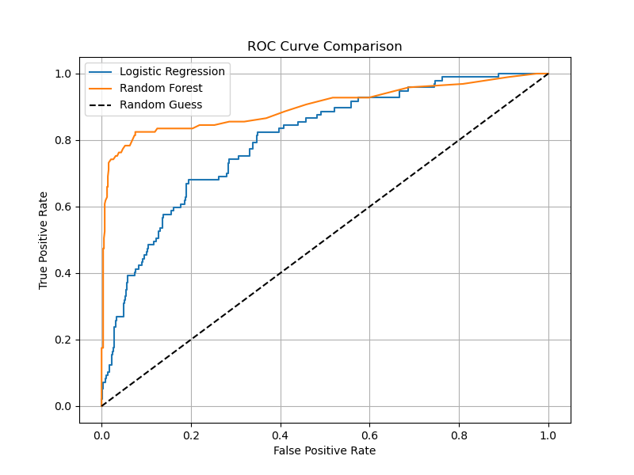
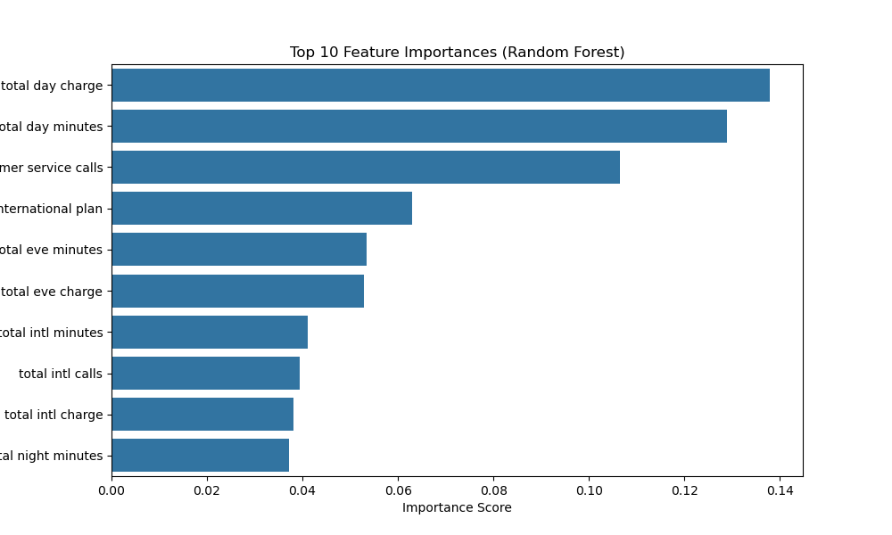

# SimuTel Customer Churn Prediction - README

**Company**: SimuTel is a mid-sized telecom provider focused on customer retention analytics.

---

## Project Summary
This project predicts customer churn using supervised machine learning to support SimuTel’s retention strategies. Churn, which is when a customer leaves the service is costly, and this project empowers the business to intervene early.

We analyzed a Kaggle dataset of 3,333 telecom users, applying classification models to identify churn drivers and generate actionable insights.

---

## Business Problem
SimuTel lacks predictive tools to flag customers at risk of leaving. This project enables targeted interventions, improving customer loyalty and reducing churn.

---

## Objectives
- Understand key drivers of churn
- Clean and prepare the dataset
- Train baseline and advanced models
- Evaluate using classification metrics
- Deliver data-driven business recommendations

---

## Workflow
### 1. Data Preparation
- Dropped non-predictive fields like `phone number`
- Encoded binary and categorical features (e.g., international plan, state)

### 2. Exploratory Data Analysis (EDA)
- Class imbalance confirmed: ~14.5% churn
- Key churn indicators identified:
  - International plan
  - Total day charge
  - Customer service calls

### 3. Modeling
- **Baseline**: Logistic Regression (interpretable)
- **Advanced**: Random Forest (nonlinear, higher performance)

### 4. Evaluation
- Metrics used: Precision, Recall, F1-score, Confusion Matrix, ROC AUC
- Visuals: ROC curves, heatmaps, feature importance rankings

---

## Visualizations
1. **Churn Distribution**: Bar chart highlighting imbalance

2. **Confusion Matrix Heatmaps**:
   - Logistic Regression: Higher false negatives

   - Random Forest: Better recall

3. **ROC Curve**:
   - RF AUC: 0.94 (Excellent)
   - LR AUC: 0.85 (Strong)

4. **Feature Importance (RF)**:
   - International plan
   - Total day charge
   - Customer service calls

---

## Model Evaluation
### Logistic Regression (Baseline)
- Precision: 0.56
- Recall: 0.31
- F1-score: 0.40
- ROC AUC: 0.85

**Interpretation**: Logistic Regression identifies churners with moderate accuracy. While its precision of 56% means over half of its churn predictions are correct, the low recall (31%) indicates it misses many actual churners. This limits its usefulness in aggressive retention campaigns where missing a churner can be costly. However, it remains valuable where interpretability is critical, such as explaining risk to business teams.

### Random Forest (Advanced)
- Precision: 0.61
- Recall: 0.51
- F1-score: 0.56
- ROC AUC: 0.94

**Interpretation**: Random Forest improves both precision and recall, catching over half of all churners (recall = 51%) while maintaining a strong ROC AUC of 0.94, indicating excellent class separation. Its higher F1-score reflects better balance in identifying true churners while minimizing false alarms. This model is more suitable for proactive retention strategies where catching churners early outweighs the need for simplicity.

## Key Insights
- International plan customers are more likely to churn
- High day-time usage and customer service complaints are warning signs
- Random Forest offers better predictive power, especially for churn detection

---

## Business Recommendations
- Target high-risk customers (international plans, high day charges) with incentives
- Improve service to reduce repeated support calls
- Deploy churn scores to prioritize outreach
- Use Logistic Regression when interpretability matters; Random Forest for performance

---

## Limitations & Future Work
- Address class imbalance (e.g., SMOTE or `class_weight='balanced'`)
- Assess ROI of retention efforts per segment
- Explore real-time churn scoring with live customer data

---

## Repository Contents
- `telecom_churn_analysis.py`: Complete analysis notebook
- `README.md`: Project overview and findings
- `Churn.csv`: Dataset used for modeling (subject to license)

---

**Author**: Margaret Kuria  
**Title**: Data Scientist 
